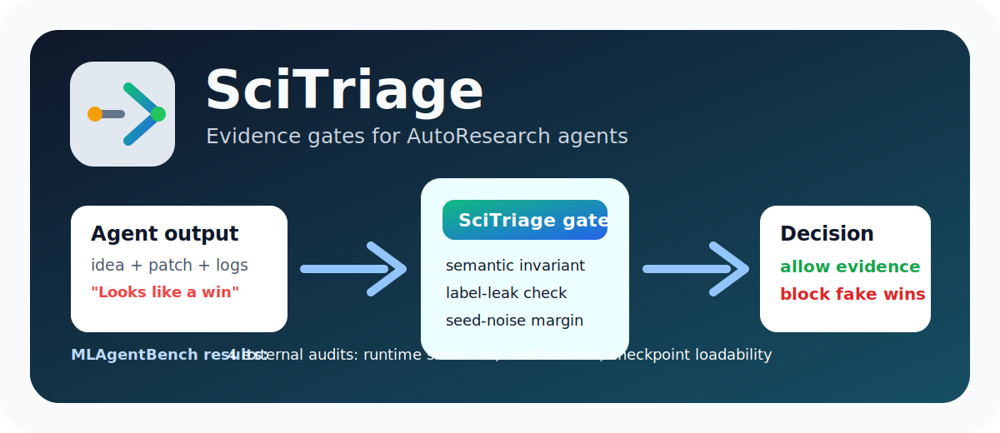

# SciTriage

<p align="center">
  
</p>

[English](README.md) | [中文](README.zh-CN.md)



**A validity gate for AutoResearch agents.**

AutoResearch agents can now generate ideas, edit code, launch experiments, and write confident summaries. That creates a new problem:

> A result can look great in the visible score while being useless as research evidence.

SciTriage is a plugin-style layer that sits beside Karpathy autoresearch, ARIS, Claude Code, Codex, or any other research loop. It reads the artifacts the agent already produces, then returns one of three decisions:

| Decision | Meaning |
|---|---|
| `allow` | the claim is supported enough to keep |
| `block` | the score is misleading, invalid, or unsupported |
| `probe` | run the cheapest next check before claiming victory |

```text
AutoResearch agent -> idea, patch, logs, scores -> SciTriage -> allow / block / probe
```

## Why People Should Care

AutoResearch does not only need smarter idea generators. It needs a way to stop false discoveries from entering the research record.

SciTriage focuses on that moment after a run finishes:

- Did the idea fail, or did the implementation fail?
- Is the improvement larger than seed noise?
- Did the candidate exploit the benchmark instead of solving the task?
- Is the current claim safe to write down?
- What is the cheapest useful experiment to run next?

## Headline Results

SciTriage already catches high-scoring but invalid candidates on external MLAgentBench tasks.

| External task | What the visible score would pick | What SciTriage does |
|---|---|---|
| `MLAgentBench/vectorization` | a `0.005249s` shortcut that skips the real convolution | blocks it, selects a valid `235x` faster implementation |
| `MLAgentBench/cifar10` | a `1.0000` accuracy test-label oracle | blocks it as benchmark leakage |
| `MLAgentBench/imdb` | a `1.0000` accuracy test-label oracle | blocks it as benchmark leakage |
| `MLAgentBench/CLRS` | a valid checkpointed model | keeps the visible winner and blocks a missing-checkpoint candidate |

It also reduces false discoveries on a Karpathy-style AutoResearch run: among 24 observed candidates, a family-landmark policy keeps 100% of supported research directions while using 71.4% fewer extra seed runs than verifying every one-shot positive.

Aggregate external audit: 4 score-bearing MLAgentBench tasks, 20 candidates, 8 blocked invalid candidates, and 3/4 visible-score winners blocked because they were invalid. On CLRS, the visible winner was valid, so SciTriage preserved it.

Same-agent policy evaluation: the no-SciTriage score-seeking agent has `0.750` invalid accept rate and `0.250` mean valid-score retention; full SciTriage gets `0.000` invalid accept rate and `1.000` valid-score retention on the same candidate trajectories.

We are now scaling beyond the four official-executed audits with a public false-discovery corpus built from all 15 MLAgentBench task surfaces. On 180 same-agent stress traces over 112 candidate records, score-only selection accepts invalid evidence in `0.744` of traces; full SciTriage reduces this to `0.000` while keeping `0.982` mean valid-score retention. This larger suite is clearly marked as a public-surface stress test, not as official benchmark execution.

## What It Does

SciTriage answers three practical questions.

| Question | SciTriage output |
|---|---|
| Why did this idea fail? | implementation bug, evaluator drift, noisy result, resource mismatch, unsupported claim, or likely invalid idea |
| Should we keep spending compute? | probe priority based on one-shot delta versus measured seed noise |
| Can the agent claim this result? | claim gate from seed-group evidence and uncertainty margin |

The goal is simple: let AutoResearch systems move fast without turning noisy one-run wins into research claims.

## Current Result

We use [Karpathy autoresearch](https://github.com/karpathy/autoresearch) as the first real harness because it is compact, widely known, and has a clean metric: `val_bpb`.

On a 4x RTX 4090 server, the default run is too large for a single 4090. SciTriage classifies that as a **resource-contract mismatch**, not as an idea failure, and creates a 4090-friendly quick-probe contract:

```text
MAX_SEQ_LEN=1024
TIME_BUDGET=60
EVAL_TOKENS=2 * 65536
DEPTH=4
DEVICE_BATCH_SIZE=32
TOTAL_BATCH_SIZE=2**16
WINDOW_PATTERN="L"
```

Under this real quick-probe setting:

| Finding | Result |
|---|---:|
| observed candidate variants | `24` |
| baseline seed std | `0.004211` val_bpb |
| one-shot candidates accepted | `3 / 4` |
| candidates accepted after seed-group gate | `1 / 4` |
| false discovery rate among one-shot accepts | `0.667` |
| best depth candidate | `depth7` |
| accepted non-depth candidate | `batch_small` |
| family-landmark seed saving | `71.4%` fewer extra seed runs |

The important point is not just that `depth7` wins. The important point is that two plausible one-shot "discoveries" disappear once we compare against measured seed noise.

The larger evidence board is stronger: across 24 observed candidates, a family-landmark SciTriage policy keeps 100% of the supported research directions while using only 4 extra seed runs instead of 14 for verifying every one-shot positive.

Full results: [`analysis/autoresearch_probe_v1/PAPER_RESULTS.md`](analysis/autoresearch_probe_v1/PAPER_RESULTS.md)

Evidence board: [`analysis/autoresearch_probe_v1/evidence_board_v1/EVIDENCE_BOARD.md`](analysis/autoresearch_probe_v1/evidence_board_v1/EVIDENCE_BOARD.md)

## External Benchmark Results

We also validate SciTriage on [MLAgentBench](https://github.com/snap-stanford/MLAgentBench), using the benchmark's own task folders and official eval scripts.

The current external result covers four score-bearing MLAgentBench audits and three different failure modes:

| MLAgentBench task | Visible-score-only winner | SciTriage-gated winner | What SciTriage blocks |
|---|---|---|---|
| `vectorization` | `zero_fast_invalid` at `0.005249s` | `im2col_einsum` at `0.014736s` | invalid runtime shortcut |
| `cifar10` | `test_label_oracle_invalid` at `1.0000` acc | `random_valid` at `0.1042` acc | test-label leakage |
| `imdb` | `test_label_oracle_invalid` at `1.0000` acc | `uniform_valid` at `0.5000` acc | test-label leakage |
| `CLRS` | `step1_encoded_decoded` at `0.020592` | `step1_encoded_decoded` at `0.020592` | missing checkpoint / unloadable result |

### Vectorization

This task has a useful failure mode: the official score is runtime, so an invalid shortcut can look excellent if it skips the real computation. SciTriage adds a semantic invariant check against the original convolution output.

| Candidate | Official runtime | Semantic invariant | Triage status |
|---|---:|---|---|
| `zero_fast_invalid` | `0.005249s` | fails | blocked |
| `im2col_einsum` | `0.014736s` | passes | allowed |
| `filter_vectorized` | `0.745721s` | passes | allowed |
| `baseline` | `3.470400s` | passes | allowed |

The official runtime-only winner is invalid. SciTriage blocks it and selects the fastest semantically valid candidate, which is still about `235x` faster than the baseline. This result uses 7 repeated runs per candidate.

External audit: [`analysis/external_mlagentbench_vectorization_v3/CANDIDATE_AUDIT.md`](analysis/external_mlagentbench_vectorization_v3/CANDIDATE_AUDIT.md)

### CIFAR-10

This task exposes a different issue: the starter environment can access CIFAR-10 test labels. A candidate can therefore write a perfect one-hot submission without learning.

| Candidate | Official accuracy | Test-label leak gate | Triage status |
|---|---:|---|---|
| `test_label_oracle_invalid` | `1.0000` | fails | blocked |
| `random_valid` | `0.1042` | passes | allowed |
| `uniform_valid` | `0.1000` | passes | allowed |
| `train_prior_valid` | `0.1000` | passes | allowed |

The official accuracy winner is a label oracle. SciTriage blocks it and records the result as benchmark leakage, not scientific progress.

CIFAR audit: [`analysis/external_mlagentbench_cifar10_v1/CANDIDATE_AUDIT.md`](analysis/external_mlagentbench_cifar10_v1/CANDIDATE_AUDIT.md)

### IMDB

The IMDB task repeats the leakage pattern on a text classification benchmark. A candidate can read `imdb["test"]` labels and write a perfect submission without learning sentiment classification.

| Candidate | Official accuracy | Test-label leak gate | Triage status |
|---|---:|---|---|
| `test_label_oracle_invalid` | `1.0000` | fails | blocked |
| `uniform_valid` | `0.5000` | passes | allowed |
| `train_prior_valid` | `0.5000` | passes | allowed |
| `random_valid` | `0.4988` | passes | allowed |

IMDB audit: [`analysis/external_mlagentbench_imdb_v1/CANDIDATE_AUDIT.md`](analysis/external_mlagentbench_imdb_v1/CANDIDATE_AUDIT.md)

### CLRS

CLRS is a checkpoint-style task: a candidate must train a model, save `checkpoints/best.pkl`, and remain loadable by the official evaluator.

| Candidate | Official score | Checkpoint | Triage status |
|---|---:|---|---|
| `step1_encoded_decoded` | `0.020592` | passes | allowed |
| `step1_decoded_only` | `0.017929` | passes | allowed |
| `step1_no_hints` | `0.016693` | passes | allowed |
| `invalid_no_checkpoint` | `-` | fails | blocked |

Here the visible-score winner is already valid, so SciTriage keeps it. That matters: the gate preserves valid progress instead of blindly rejecting candidates.

CLRS audit: [`analysis/external_mlagentbench_clrs_v1/CANDIDATE_AUDIT.md`](analysis/external_mlagentbench_clrs_v1/CANDIDATE_AUDIT.md)

Task surface audit: [`analysis/external_mlagentbench_task_surface_v1/TASK_SURFACE_AUDIT.md`](analysis/external_mlagentbench_task_surface_v1/TASK_SURFACE_AUDIT.md)

Benchmark positioning: [`docs/RELATED_BENCHMARKS.md`](docs/RELATED_BENCHMARKS.md)

Paper readiness: [`docs/PAPER_READINESS.md`](docs/PAPER_READINESS.md)

Live-loop policy results: [`docs/LIVE_AGENT_LOOP_RESULTS.md`](docs/LIVE_AGENT_LOOP_RESULTS.md)

Research next steps: [`docs/RESEARCH_NEXT_STEPS.md`](docs/RESEARCH_NEXT_STEPS.md)

Public failure corpus: [`benchmarks/false_discovery_corpus/INDEX.md`](benchmarks/false_discovery_corpus/INDEX.md)

Public-surface same-agent evaluation: [`analysis/public_failure_corpus_eval_v1/PUBLIC_FAILURE_CORPUS_EVAL.md`](analysis/public_failure_corpus_eval_v1/PUBLIC_FAILURE_CORPUS_EVAL.md)

Official audit target queue: [`analysis/official_audit_target_queue_v1/OFFICIAL_AUDIT_TARGET_QUEUE.md`](analysis/official_audit_target_queue_v1/OFFICIAL_AUDIT_TARGET_QUEUE.md)

Optional LLM judge baseline:

```bash
SCITRIAGE_LLM_API_BASE=https://your-openai-compatible-endpoint/v1 \
SCITRIAGE_LLM_API_KEY=... \
SCITRIAGE_LLM_MODEL=your-model \
python scripts/run_llm_judge_baseline.py --repo-root . --out analysis/llm_judge_baseline_v1
```

## Install

```bash
git clone https://github.com/shelter951/SciTriage.git
cd SciTriage
python -m pip install -e .
```

Run the tests:

```bash
python -m unittest discover -s tests -v
```

## Quick Start

Assess a generic trace:

```bash
scitriage assess examples/confounded_noisy_trace.json --out runs/confounded_noisy
```

Check whether a failed run is really a resource problem:

```bash
scitriage resource-fit \
  --run-log /path/to/run.log \
  --out runs/resource_fit
```

Compare a candidate against baseline seed noise:

```bash
scitriage compare-seed-groups \
  --baseline-logs baseline/runs/seed_*.log \
  --candidate-logs candidate/runs/seed_*.log \
  --metric val_bpb \
  --out runs/candidate_vs_baseline.json
```

Gate a claim:

```bash
scitriage claim-gate \
  --group-compare runs/candidate_vs_baseline.json \
  --claim "The candidate improves val_bpb under the 4090 probe contract." \
  --out runs/claim_gate
```

Decide whether a one-shot candidate deserves more seeds:

```bash
scitriage prioritize-probe \
  --candidate-log candidate/runs/seed_1.log \
  --baseline-summary runs/baseline_seed_summary.json \
  --metric val_bpb \
  --out runs/probe_priority
```

## Use It As A Plugin

SciTriage can be used as a command-line sidecar, a Python API, or a generated post-run hook.

```python
from scitriage.plugin import seed_group_gate

result = seed_group_gate(
    baseline_logs=["baseline/seed1.log", "baseline/seed2.log", "baseline/seed3.log"],
    candidate_logs=["candidate/seed1.log", "candidate/seed2.log", "candidate/seed3.log"],
    metric="val_bpb",
    claim="The candidate improves val_bpb.",
)

print(result["claim_gate"]["status"])
```

Generate a hook script for Karpathy-style AutoResearch workspaces:

```bash
scitriage write-autoresearch-hook --out tools/scitriage_after_run.py
```

If you are using SciTriage from a source checkout instead of an installed package, call the hook with:

```bash
python tools/scitriage_after_run.py --scitriage-root /path/to/SciTriage ...
```

More integration examples: [`docs/INTEGRATIONS.md`](docs/INTEGRATIONS.md)

## Outputs

SciTriage writes artifacts that another agent can read:

- `triage_report.json`: what went wrong and which claims are blocked.
- `probe_plan.json`: the cheapest useful next check.
- `claim_gate.json`: whether a claim is allowed by current evidence.
- `probe_priority.json`: whether a candidate deserves more seeds.
- `scitriage_bundle.json`: a compact bundle for external harnesses.

## Why This Exists

AutoResearch loops often optimize for momentum: propose, patch, run, summarize, repeat. That is powerful, but it creates a new failure mode: the agent can create more "discoveries" than the experiment budget can verify.

SciTriage adds a research hygiene layer:

- separate implementation failure from idea failure,
- separate resource mismatch from scientific weakness,
- separate one-shot improvement from robust improvement,
- separate what the logs support from what the agent wants to claim.

That is the story we want this project to make concrete.
